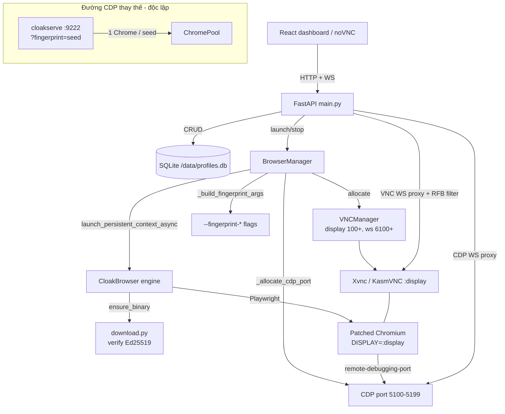

# 01 — Deep-dive kiến trúc CloakBrowser + Manager

> Phân tích kỹ thuật sâu **dựa trên CODE thật** trong `refs/`. Mọi khẳng định
> đối chiếu file:line theo dạng `path#Lstart-Lend`. Không suy diễn: khi code
> không nói rõ, tài liệu ghi "không xác định trong code".
>
> Đối tượng: `refs/CloakBrowser` (engine — wrapper Python quanh binary Chromium
> patch) và `refs/CloakBrowser-Manager` (manager — FastAPI + SQLite + KasmVNC).

## 0. Bản đồ 2 repo

| Lớp | Repo | Vai trò |
|-----|------|---------|
| **Engine** | `refs/CloakBrowser/cloakbrowser/` | Tải + verify binary, dựng CLI flags fingerprint, gọi Playwright `launch_persistent_context`. |
| **CDP multiplexer** | `refs/CloakBrowser/bin/cloakserve` | 1 cổng CDP → nhiều Chrome theo `fingerprint` seed. |
| **Manager backend** | `refs/CloakBrowser-Manager/backend/` | CRUD profile (SQLite), cấp display/port, launch/stop, proxy VNC + CDP qua WebSocket. |

Luồng chính: **Profile (SQLite) → fingerprint flags → `launch_persistent_context_async` → Xvnc/KasmVNC → noVNC proxy + CDP proxy**.

---

## 1. Engine — vòng đời binary (download + verify + tier)

### 1.1 Phiên bản & nền tảng

- `CHROMIUM_VERSION = "146.0.7680.177.5"` là bản mới nhất để hiển thị/tham chiếu
  (`refs/CloakBrowser/cloakbrowser/config.py#L18`); phiên bản **thực dùng** lấy
  theo nền tảng qua `PLATFORM_CHROMIUM_VERSIONS` (`config.py#L20-26`) và
  `get_chromium_version()` (`config.py#L128-131`).
- Nền tảng hỗ trợ: `linux-x64/arm64`, `darwin-arm64/x64`, `windows-x64`
  (`config.py#L91-98`). Không có binary phù hợp → `check_platform_available()`
  gợi ý đặt `CLOAKBROWSER_BINARY_PATH` (`config.py#L183-199`).
- Ghim phiên bản qua `CLOAKBROWSER_VERSION` (chỉ chấp nhận dạng số chấm hợp lệ vì
  giá trị được nội suy vào path/URL — `config.py#L104-125`).

### 1.2 Cache & phân giải phiên bản

- Cache mặc định của wrapper gốc là `~/.cloakbrowser/` (override
  `CLOAKBROWSER_CACHE_DIR`) — `config.py#L150-159`. **BrowserX đổi default sang
  `~/.browserx/engine/`** (env override giữ nguyên; tự migrate dir cũ — docs/03
  §3.1). Thư mục binary: `chromium-<v>` hoặc `chromium-<v>-pro`
  (`config.py#L162-166`); đường dẫn exe khác nhau theo OS (macOS `.app`, Windows
  `chrome.exe`, Linux `chrome`) — `config.py#L169-180`.
- `get_effective_version()` đọc marker `latest_version_<tag>` / `latest_pro_version_<tag>`
  để dùng bản đã auto-update nếu mới hơn (`config.py#L202-237`).

### 1.3 `ensure_binary()` — cây quyết định

`ensure_binary()` (`refs/CloakBrowser/cloakbrowser/download.py#L131-259`) theo thứ tự:

1. **Local override**: `CLOAKBROWSER_BINARY_PATH` → dùng thẳng, bỏ qua tải
   (`download.py#L146-154`; `config.py#L289-294`).
2. **Pro tier**: có license key hợp lệ → `_ensure_pro_binary()`
   (`download.py#L165-185`, `#L307-368`). Lỗi xác thực (`BinaryVerificationError`)
   được **ném thẳng**, không âm thầm tụt về free (`download.py#L51-59`, `#L172-185`).
   Đặt `CLOAKBROWSER_DOWNLOAD_URL` sẽ vô hiệu hoá đường Pro (`download.py#L162-163`).
3. **Free tier**: `get_effective_version()` → nếu chưa có thì tải bản hardcoded
   của nền tảng (`download.py#L223-259`).

### 1.4 Xác thực toàn vẹn — Ed25519 (trust root)

- Mỗi release công bố `SHA256SUMS` + chữ ký tách rời `SHA256SUMS.sig`. Wrapper
  **verify chữ ký Ed25519 TRƯỚC** (so với khoá ghim `BINARY_SIGNING_PUBKEYS` —
  `config.py#L37-39`), rồi mới tin bất kỳ hash nào trong manifest
  (`download.py#L474-544`, hàm `_verify_signature` `#L589-628`).
- **Version binding**: manifest phải khai đúng version yêu cầu (dòng `version=`)
  để chặn tấn công ép tụt phiên bản (`download.py#L525-535`, `#L547-557`).
- Kiểm SHA-256 archive so manifest đã xác thực (`_verify_checksum` `#L671-686`).
- Đường **self-host** (`CLOAKBROWSER_DOWNLOAD_URL`): khoá ghim không áp dụng → rơi
  về checksum same-origin, có thể bỏ qua bằng `CLOAKBROWSER_SKIP_CHECKSUM`
  (`download.py#L489-511`). Đường chính thức **không** bỏ qua được.
- Pro cũng verify chữ ký y hệt (`_verify_pro_download` `#L409-471`).
- Giải nén có chống path-traversal cho cả tar & zip (`download.py#L761-796`).

### 1.5 Auto-update

- Sau khi dùng cache, kích hoạt kiểm tra nền (daemon thread), rate-limit 1 giờ
  (`UPDATE_CHECK_INTERVAL = 3600` — `download.py#L66`; `_maybe_trigger_update_check`
  `#L1042-1053`; `_check_and_download_update` `#L1007-1039`). Nguồn: GitHub Releases
  API (`config.py#L258`, `download.py#L943-962`). Tắt bằng `CLOAKBROWSER_AUTO_UPDATE=false`.

---

## 2. Engine — fingerprint qua CLI flags

Điểm cốt lõi: **stealth điều khiển bằng command-line flags** truyền vào binary đã
patch, KHÔNG dùng CDP emulation (dễ bị phát hiện).

### 2.1 Stealth args mặc định

`get_default_stealth_args()` (`config.py#L54-76`): `--no-sandbox`,
`--fingerprint=<seed ngẫu nhiên 10000-99999>`; trên macOS thêm
`--fingerprint-platform=macos` (chạy như Mac thật, không giả Windows để tránh lệch
font/GPU), còn lại `--fingerprint-platform=windows`.

Ngoài ra `IGNORE_DEFAULT_ARGS = ["--enable-automation", "--enable-unsafe-swiftshader"]`
(`config.py#L47`) — Playwright thêm 2 flag này làm lộ `navigator.webdriver` và
renderer SwiftShader; wrapper loại bỏ qua `ignore_default_args` khi launch
(`browser.py#L577`).

### 2.2 `build_args()` — hợp nhất & khử trùng

`build_args()` (`browser.py#L1028-1087`) gộp stealth defaults + user args + flag
locale/timezone, **khử trùng theo key** (phần trước `=`), ưu tiên:
`stealth < user args < tham số chuyên dụng`. Cụ thể:
`--fingerprint-timezone=<tz>` (`#L1065-1070`); locale set cả `--lang` và
`--fingerprint-locale` (`#L1071-1076`); extension qua `--load-extension` +
`--disable-extensions-except` (`#L1078-1085`).

---

## 3. Engine — `launch_persistent_context_async`

Hàm chính (`refs/CloakBrowser/cloakbrowser/browser.py#L474-600`), trình tự:

1. `ensure_binary()` lấy đường dẫn binary (`#L542`).
2. `maybe_resolve_geoip()` — nếu bật `geoip` + có proxy: tự suy timezone/locale từ
   IP thoát của proxy, đồng thời lấy `exit_ip` cho WebRTC (`#L543`, `#L954-984`).
3. `_resolve_proxy_config()` tách proxy thành kwargs Playwright + Chrome args (§4).
4. `_resolve_webrtc_args()` thay `--fingerprint-webrtc-ip=auto` bằng IP thoát thực
   (`#L545`, `#L987-1017`).
5. `build_args()` dựng danh sách flag cuối cùng (`#L549`).
6. **locale/timezone set qua flag binary, KHÔNG qua context kwargs Playwright**
   (chú thích rõ ở `#L558-559`).
7. `pw.chromium.launch_persistent_context(..., executable_path=binary,
   ignore_default_args=IGNORE_DEFAULT_ARGS, ...)` (`#L572-580`).
8. Patch `context.close` để dừng luôn Playwright (`#L582-591`); nếu `humanize` thì
   vá hành vi chuột/bàn phím/scroll (`#L593-598`).

Persistent context lưu cookies/localStorage/cache trong `user_data_dir` (`#L494-499`).

---

## 4. Engine — phân giải proxy

`_resolve_proxy_config()` (`browser.py#L1305-1351`) trả về `(proxy_kwargs, extra_chrome_args)`:

- **SOCKS5** (`socks5://`, `socks5h://`): bỏ qua Playwright, truyền thẳng
  `--proxy-server=...` cho Chrome (Chrome tự xử auth SOCKS5), re-encode credential
  để tránh Chromium cắt password ở ký tự đặc biệt (`#L1297-1332`, issue #157).
- **HTTP/HTTPS có credential**: nếu nền tảng + version hỗ trợ preemptive auth thì
  cũng truyền inline qua `--proxy-server`, né interceptor CDP của Playwright (bị lỗi
  407 với một số proxy/Google) — `#L1334-1346`, issue #182. Điều kiện hỗ trợ:
  `linux-x64`/`windows-x64` và version ≥ `146.0.7680.177.5`
  (`_supports_http_proxy_inline_auth` `#L1277-1294`).
- **HTTP/HTTPS không credential**: dùng proxy dict của Playwright (`#L1348-1351`).

---

## 5. `cloakserve` — CDP multiplexer per-seed

`refs/CloakBrowser/bin/cloakserve` (aiohttp server) cho phép **1 cổng CDP phục vụ
nhiều Chrome, mỗi `fingerprint` seed = một danh tính riêng** (docstring `#L1-16`).

- **Client kết nối**: `connect_over_cdp("http://host:9222?fingerprint=12345&timezone=...&locale=...")`
  (mặc định port `9222` — `#L768`, `#L871-875`).
- **`ChromePool.get_or_launch(seed)`** (`#L286-410`): mỗi seed có một
  `ChromeProcess` (`#L159-168`) trên cổng riêng cấp phát từ `BASE_CDP_PORT = 5100`
  (`#L64`, `#L215-226`). Seed hợp lệ theo `SAFE_SEED_RE` (`^[A-Za-z0-9_-]{1,128}$`)
  và loại `__default__` (`#L66-67`, `#L309-315`). **First-launch-wins**: seed đang
  chạy thì bỏ qua tham số mới (`#L325-332`).
- Dựng flag qua `build_args()` dùng chung với engine, thêm `--fingerprint=<seed>`,
  proxy, WebRTC, geoip (`#L342-360`).
- **Query param → flag**: tham số lạ (không thuộc `fingerprint/proxy/geoip/locale/
  timezone`) map thành `--fingerprint-{key}={val}` (`parse_connection_params`
  `#L476-505`).
- **Định tuyến WebSocket**: `/fingerprint/{seed}/devtools/{path}` (per-seed) và
  `/devtools/{path}` (default) — `#L862-865`; `/json/version` & `/json/list` được
  viết lại `webSocketDebuggerUrl` để đi qua multiplexer (`#L554-635`).
- **Idle cleanup**: hết kết nối + quá `idle_timeout` thì kill Chrome, xoá user-data
  (`#L228-284`). Bảo vệ Origin cho WS (chống CSRF vào CDP local — `#L105-152`).
- Trong container bind `0.0.0.0`, ngoài container `127.0.0.1` (`#L877-879`).

> Ghi chú: Manager (`backend/`) **không** dùng `cloakserve`; nó tự cấp CDP port và
> tự proxy (§8–§9). `cloakserve` là con đường CDP thay thế, độc lập.

---

## 6. Manager — mô hình dữ liệu (SQLite)

`refs/CloakBrowser-Manager/backend/database.py`:

- DB tại `/data/profiles.db` (`#L14-15`); mở với `PRAGMA journal_mode=WAL` +
  `foreign_keys=ON` cho đọc/ghi đồng thời (`#L18-27`).
- Bảng `profiles` (`#L34-59`): `id` (UUID), `fingerprint_seed`, `proxy`, `timezone`,
  `locale`, `platform` (mặc định `windows`), `user_agent`, `screen_width/height`,
  `gpu_vendor/renderer`, `hardware_concurrency`, `humanize/human_preset`, `headless`,
  `geoip`, `clipboard_sync`, `auto_launch`, `color_scheme`, `user_data_dir`, timestamps.
- Bảng `profile_tags` FK `ON DELETE CASCADE` (`#L61-66`). Migration cộng dồn cột
  `clipboard_sync/launch_args/auto_launch` cho DB cũ (`#L70-80`).
- `create_profile()` sinh UUID + seed ngẫu nhiên `10000-99999` nếu không truyền,
  `user_data_dir = /data/profiles/<id>` (`#L87-138`).
- Model API (Pydantic) ở `backend/models.py`: `ProfileCreate` (`#L10-32`) với
  `platform: Literal["windows","macos","linux"]` (`#L16`).

---

## 7. Manager — cấp phát display/port (KasmVNC)

`backend/vnc_manager.py`:

- `allocate()` cấp `display` từ `BASE_DISPLAY = 100`, `ws_port = 6100 + (display-100)`
  (`#L22-37`) — mỗi profile một display + cổng WebSocket riêng.
- `start_vnc()` chạy `Xvnc :<display>` (KasmVNC) với `-websocketPort`, `-rfbport -1`
  (chỉ WebSocket, tắt TCP thô), `-SecurityTypes None`, `-interface 127.0.0.1` (chỉ
  nội bộ, FastAPI proxy ra ngoài), `-httpd /usr/share/kasmvnc/www` để bật handler
  WebSocket (`#L39-94`).
- `stop_vnc()` terminate→kill kèm giải phóng allocation (`#L96-109`);
  `cleanup_stale()` dùng `pkill -f "Xvnc :[0-9]"` dọn tiến trình mồ côi (`#L119-129`).

---

## 8. Manager — vòng đời launch/stop (`BrowserManager`)

`backend/browser_manager.py`. `launch(profile)` (`#L167-287`):

1. Khoá theo `profile_id` chống double-launch (`#L171-174`).
2. `vnc.allocate()` lấy display+ws_port (`#L176`); `_allocate_cdp_port()` cấp CDP
   port xoay vòng trong `5100-5199` để né TIME_WAIT (`#L145-146`, `#L364-377`).
3. Xoá lock cũ của Chromium (`SingletonLock/Cookie/Socket`) — `#L187-190`.
4. `_init_profile_defaults()` tạo bookmarks (bộ test detection/fingerprint) +
   DuckDuckGo mặc định lần đầu (`#L56-142`, gọi ở `#L193`).
5. `start_vnc()` trên display đã cấp (`#L197-202`).
6. `_build_fingerprint_args()` (`#L379-415`): luôn có `--disable-infobars`,
   `--test-type`, `--use-angle=swiftshader` (GL phần mềm cho VNC không GPU); thêm
   `--fingerprint=<seed>`, `--fingerprint-platform`, `--fingerprint-gpu-vendor/renderer`,
   `--fingerprint-hardware-concurrency`, `--fingerprint-screen-width/height` theo profile.
7. Chuẩn hoá/validate proxy (`host:port:user:pass` → URL) — `#L22-53`, `#L209-213`.
8. Gọi `launch_persistent_context_async(...)` với `DISPLAY=:<display>` truyền qua
   `env` (tránh sửa `os.environ` toàn cục), viewport trừ `133px` chrome UI
   (`#L217-234`).
9. Tiêm init-script bắt clipboard (sự kiện `copy`/Ctrl-C) — `#L238-257`.
10. `context.on("close", ...)` để tự dọn khi Chrome sập/đóng qua VNC (`#L268-270`).

`stop()`/`_on_browser_closed()` đóng context + `stop_vnc` (`#L289-314`).
`auto_launch_all()` khởi động các profile `auto_launch=True` lúc boot, timeout 60s
mỗi profile (`#L342-362`).

---

## 9. Manager — API & proxy (FastAPI)

`backend/main.py`:

- **Auth tuỳ chọn**: nếu đặt `AUTH_TOKEN` thì mọi `/api/*` (trừ `/api/auth/*`,
  `/api/status`) cần Bearer token/cookie, dùng raw ASGI middleware để không phá
  WebSocket (`#L48-173`).
- **CRUD/launch/stop**: `/api/profiles...` (`#L438-564`); xoá profile dừng browser
  rồi xoá DB + `user_data_dir` (`#L500-519`). `/api/status` trả version binary từ
  `cloakbrowser.config.CHROMIUM_VERSION` (`#L570-579`).
- **VNC WebSocket proxy** `/api/profiles/{id}/vnc` (`#L677-838`): cầu nối noVNC ↔
  KasmVNC. Do noVNC v1.4 gộp nhiều message RFB/gửi type mở rộng mà KasmVNC 1.3.3
  không hỗ trợ, proxy **lọc & viết lại luồng RFB**: whitelist encoding, chuyển
  `PointerEvent` 6→11 byte, dịch clipboard type 180 → `ServerCutText`
  (`#L188-372`).
- **CDP WebSocket proxy** `/api/profiles/{id}/cdp` (+ `/cdp/devtools/{path}`) —
  passthrough JSON hai chiều, viết lại `webSocketDebuggerUrl` trong `/json/version`
  & `/json/list` để trỏ qua proxy (`#L845-1016`). Có kiểm Origin chống CSWSH
  (`#L89-136`).
- **Clipboard relay**: `POST` đẩy text vào X clipboard qua `xclip`; `GET` đọc qua
  Playwright (`window.__clipboardText`), fallback `xclip` (`#L582-671`).

---

## 10. Sơ đồ kiến trúc

---

## 11. Nhận xét về mục tiêu "hàng nghìn profiles"

Đối chiếu code (không phải khuyến nghị thiết kế BrowserX, chỉ ghi nhận giới hạn hiện có):

- **Trần cứng theo dải port**: Manager giới hạn CDP `5100-5199` = **100 slot**
  (`browser_manager.py#L145-146`); display/ws_port tăng tuyến tính không có trần rõ
  ràng (`vnc_manager.py#L22-37`). `cloakserve` cấp port từ `5100` quét tối đa 100 lần
  (`bin/cloakserve#L215-226`). ⇒ Ở mức hiện tại, số profile chạy đồng thời **bị chặn
  ~100** bởi dải CDP.
- **Đơn tiến trình, một container**: `BrowserManager`/`VNCManager` là singleton trong
  process, state in-memory (`main.py#L176-177`) — không có lớp điều phối đa-node.
- **Mỗi profile = 1 Xvnc + 1 Chrome**: chi phí RAM/CPU tuyến tính; render dùng
  SwiftShader phần mềm (`browser_manager.py#L384`).

> Kết luận: kiến trúc kế thừa phù hợp quy mô hàng chục–~100 profile/node. Muốn "hàng
> nghìn", cần mở rộng dải port và/hoặc điều phối đa-node — thuộc phạm vi thiết kế
> BrowserX (docs khác), không có sẵn trong `refs/`.

---

## 12. Bảng tham chiếu nhanh (file:line)

| Cơ chế | Tham chiếu |
|--------|-----------|
| Version/nền tảng | `config.py#L18-26`, `#L91-98`, `#L128-131` |
| Cache/marker | `config.py#L150-166`, `#L202-237` |
| `ensure_binary` (tier) | `download.py#L131-259` |
| Verify Ed25519 + version binding | `download.py#L474-544`, `#L589-628`; `config.py#L37-39` |
| Auto-update | `download.py#L1007-1053`, `#L66` |
| Stealth flags mặc định | `config.py#L47`, `#L54-76` |
| `build_args` | `browser.py#L1028-1087` |
| `launch_persistent_context_async` | `browser.py#L474-600` |
| Proxy resolution | `browser.py#L1277-1351` |
| geoip / WebRTC | `browser.py#L954-1017` |
| `cloakserve` multiplexer | `bin/cloakserve#L174-410`, `#L554-635`, `#L862-879` |
| SQLite schema/WAL | `database.py#L14-138` |
| VNC display/port | `vnc_manager.py#L22-129` |
| BrowserManager launch | `browser_manager.py#L167-415` |
| FastAPI auth/API/proxy | `main.py#L48-173`, `#L438-1016` |
