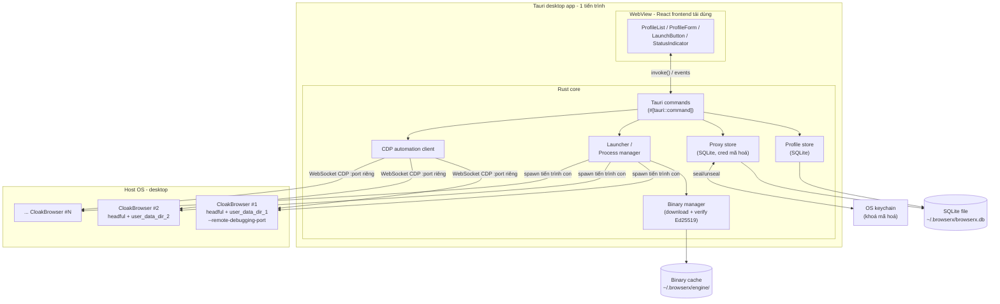
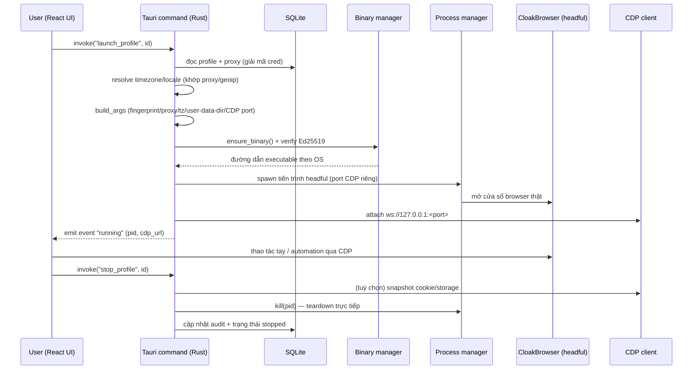

# 03 — Kiến trúc mục tiêu: app LOCAL desktop bằng Rust (CloakBrowser-locked)

> **BrowserX** là ứng dụng desktop **chạy local, cross-platform (macOS / Linux /
> Windows)**, quản lý hàng nghìn profiles và mở **cửa sổ browser thật (headful)**
> ngay trên máy người dùng — **không VNC, không server**. Tài liệu này viết lại
> hoàn toàn theo hướng đã chốt trong Spec, mục **"🔁 ĐỔI HƯỚNG: App LOCAL desktop
> bằng RUST (chốt 2026-07-01)"**, thay cho bản kiến trúc server/Postgres/K8s/VNC cũ.
>
> **Stack chốt:** **Rust** (core) + **SQLite** (lưu profile/proxy/settings) +
> **Tauri** (desktop shell) + **tái dùng React frontend** của
> `refs/CloakBrowser-Manager/frontend` (thay backend FastAPI Python). **Khoá cứng
> CloakBrowser** (Q2) — không lớp adapter đa-engine. Rust **spawn binary
> CloakBrowser trực tiếp** (không nhúng Python), port logic dựng flags từ
> `refs/CloakBrowser/cloakbrowser/browser.py` + `config.py`.
>
> Quy ước: khẳng định kỹ thuật đối chiếu code tham chiếu bằng `path#Lstart-Lend`
> (theo `refs/`). Phần "mục tiêu" là **thiết kế đề xuất cho BrowserX**, chưa tồn
> tại trong `refs/`. Kiến trúc server K8s/Postgres/VNC coi là **phương án scale
> tương lai** (xem §5).

---

## 0. Nguyên tắc thiết kế (design principles)

1. **Local-first, single-process desktop app.** Không API server, không container,
   không Docker. Toàn bộ control-plane (UI + logic + DB) nằm trong **một tiến trình
   Tauri** trên máy user; browser là các **tiến trình con** do Rust spawn.
2. **Headful thật thay VNC.** Mở trực tiếp cửa sổ Chromium trên desktop host →
   loại bỏ toàn bộ phụ thuộc Linux-only (Xvnc/KasmVNC/xclip) và lớp proxy RFB thủ
   công mong manh (`refs/CloakBrowser-Manager/backend/app/main.py#L677-L838`).
   Automation vẫn qua **CDP** (attach vào endpoint `--remote-debugging-port`).
3. **Spawn binary trực tiếp, không nhúng Python.** Rust tự dựng danh sách CLI flags
   (port từ `build_args` `browser.py#L1028-L1087`) rồi `Command::spawn` binary
   CloakBrowser — không cần Playwright/Python runtime.
4. **Khoá cứng CloakBrowser.** Chỉ Chromium desktop (`config.py#L91-L98`); không lớp
   adapter đa-engine (đánh đổi có ý thức — rủi ro bus-factor R2 ở `docs/02`).
5. **Mã hoá at-rest bí mật nhạy cảm.** Proxy credential và cookie/session snapshot
   được mã hoá bằng khoá lưu trong OS keychain — vá plaintext-proxy của bản gốc
   (`refs/CloakBrowser-Manager/backend/app/database.py#L38`).
6. **Nghìn *lưu trữ* ≠ nghìn *chạy đồng thời*.** SQLite lưu hàng nghìn profiles gần
   như miễn phí; số phiên **chạy đồng thời** bị chặn bởi RAM host (~0.3–1GB/phiên)
   → hàng đợi + giới hạn song song trong Rust (§6).

---

## 1. Sơ đồ kiến trúc tổng thể (Tauri app)

**Đọc sơ đồ:** React (chạy trong WebView của Tauri) gọi **Tauri commands** qua
`invoke()` thay cho HTTP `fetch("/api/...")` của bản gốc
(`refs/CloakBrowser-Manager/frontend/src/lib/api.ts#L91-L96`). Rust core giữ 4 khối
chính (profile store, proxy store, launcher/process-manager, CDP client) + binary
manager. Mỗi profile khi chạy = **một tiến trình CloakBrowser headful riêng** với
`user_data_dir` và cổng CDP riêng; Rust theo dõi PID và teardown trực tiếp (không
`pkill` toàn cục như `refs/CloakBrowser-Manager/backend/app/vnc_manager.py#L120-L129`).

---

## 2. Mô hình dữ liệu SQLite

Kế thừa schema profile của bản gốc (`database.py#L34-L66`) nhưng **local, một file**
tại `~/.browserx/browserx.db`, và **bổ sung mã hoá at-rest** cho bí mật.

| Bảng | Cột chính | Ghi chú vs bản gốc (`refs/`) |
|---|---|---|
| `profiles` | id(UUID), name, fingerprint_seed, platform, timezone, locale, screen_width/height, gpu_vendor/renderer, hardware_concurrency, humanize, human_preset, headless, geoip, color_scheme, launch_args(JSON), user_data_dir, notes, created_at, updated_at | mở rộng từ `profiles` (`database.py#L34-L59`); trùng interface `Profile` FE (`api.ts#L4-L35`) |
| `proxies` | id, label, scheme (http/https/socks5), host, port, **username_enc**, **password_enc**, health_status, last_checked_at | **mới/tách riêng** — thay `proxy TEXT` plaintext (`database.py#L38`); credential **mã hoá** |
| `profile_proxy` | profile_id, proxy_id | gán proxy per-profile (bản gốc nhét inline vào `profiles.proxy`) |
| `tags` / `profile_tags` | tag, color / profile_id, tag | như bản gốc (`database.py#L61-L66`) |
| `settings` | key, value | **mới** — cấu hình app (concurrency cap, cache dir, theme...) |
| `audit` | id, ts, action, target_id, meta(JSON) | **mới** — nhật ký thao tác local (tạo/sửa/launch/stop) |

**Mã hoá at-rest (bắt buộc):**

- **Khoá gốc** sinh 1 lần, lưu trong **OS keychain** (macOS Keychain / Windows
  Credential Manager / Linux Secret Service) — không nằm trong file DB.
- **Proxy credential** (`username_enc`, `password_enc`): mã hoá AEAD (XChaCha20-
  Poly1305 hoặc AES-256-GCM) trước khi ghi SQLite; chỉ giải mã trong RAM ngay
  trước khi dựng URL `--proxy-server` (port từ `_resolve_proxy_config`
  `browser.py#L1305-L1352`). → vá plaintext-proxy (R6, `database.py#L38`).
- **Cookie/session at-rest:** `user_data_dir` của mỗi profile (nơi
  `launch_persistent_context` lưu cookie/localStorage — `browser.py#L367-L405`,
  `#L494-L499`) đặt trong vùng dữ liệu app; khi **export/backup** phải đóng gói +
  **mã hoá** bằng cùng khoá keychain. (Tuỳ chọn nâng cao: mã hoá cả thư mục qua
  OS-level encryption; mặc định chỉ mã hoá bản export để giữ tương thích Chromium.)

---

## 3. Launcher: Rust dựng flags & spawn binary theo OS

### 3.1 Đường dẫn binary theo OS

Port trực tiếp từ `config.py get_binary_path()` (`config.py#L169-L181`):

| OS | Đường dẫn executable (dưới `~/.browserx/engine/chromium-<version>/`) | Ref |
|---|---|---|
| macOS (Darwin) | `Chromium.app/Contents/MacOS/Chromium` | `config.py#L173-L175` |
| Windows | `chrome.exe` | `config.py#L176-L177` |
| Linux | `chrome` (binary phẳng) | `config.py#L178-L180` |

Cache dir mặc định của BrowserX là **`~/.browserx/engine/`** (W58e — gom về data
dir của app; env `CLOAKBROWSER_CACHE_DIR` vẫn override được). Wrapper Python gốc
dùng `~/.cloakbrowser/` (`config.py#L150-L159`); app startup **tự migrate** dir cũ
này sang dir mới bằng `fs::rename` (một lần, chỉ khi dir mới chưa tồn tại). Thư mục
`engine/` bị **loại khỏi backup encrypted** (binary tải lại được). Phiên bản
Chromium theo platform lấy từ
`PLATFORM_CHROMIUM_VERSIONS` (`config.py#L20-L26`: `linux-x64`, `linux-arm64`,
`darwin-arm64`, `darwin-x64`, `windows-x64`) và mapping `(system, machine) → tag`
trong `SUPPORTED_PLATFORMS` (`config.py#L91-L98`). Rust tái hiện logic này bằng
`std::env::consts::OS`/`ARCH`.

### 3.2 Dựng CLI flags (port `build_args`)

Rust dựng `Vec<String>` flags theo `build_args` (`browser.py#L1028-L1087`), **dedup
theo key** (phần trước `=`), thứ tự ưu tiên: stealth mặc định < user args < tham số
chuyên biệt (timezone/locale):

- **Stealth mặc định** từ `get_default_stealth_args` (`config.py#L54-L76`):
  `--no-sandbox` (`#L64`) + `--fingerprint=<seed>` + `--fingerprint-platform=<os>`.
  Giá trị `<os>` chỉ là **mặc định theo host** (macOS→`macos` `#L68-L70`;
  Linux/Win→`windows` `#L72-L76`); BrowserX cho **override theo lựa chọn profile**,
  không hardcode theo host — xem §6.
- **`--ignore-gpu-blocklist`** khi headful (mọi OS) hoặc Windows (`browser.py#L1054-L1055`).
- **Timezone/locale:** `--fingerprint-timezone=<tz>`, `--lang=<locale>`,
  `--fingerprint-locale=<locale>` (`browser.py#L1065-L1076`) — đặt qua **flag binary**,
  KHÔNG dùng CDP emulation (bản gốc ghi rõ: emulation dễ bị phát hiện,
  `browser.py#L429-L430`, `#L558-L559`).
- **Proxy:** port `_resolve_proxy_config` (`browser.py#L1305-L1352`): SOCKS5 và
  HTTP-có-credential → `--proxy-server=<url có inline creds>` (`#L1321-L1346`);
  Rust giải mã cred từ SQLite ngay trước bước này.
- **Persistent profile & headful:** thêm `--user-data-dir=<path>` +
  `--remote-debugging-port=<port riêng>`. Ở chế độ headful **không emulate viewport**
  (để page bám cửa sổ thật, tránh `outerWidth < innerWidth` = dấu hiệu bot —
  `browser.py#L40-L65`, `#L87-L99`). Rust cũng phải **bỏ** các default-arg lộ
  automation: `--enable-automation`, `--enable-unsafe-swiftshader`
  (`IGNORE_DEFAULT_ARGS` `config.py#L47`) — nghĩa là **không** tự thêm chúng khi spawn.

### 3.3 Spawn tiến trình

Bản gốc gọi Playwright `chromium.launch_persistent_context(executable_path=...,
args=..., headless=False)` (`browser.py#L571-L580`). BrowserX bỏ Playwright: Rust
dùng `tokio::process::Command` với `executable_path` (§3.1) + flags (§3.2), giữ
`Child`/PID trong process-manager để `kill()` khi teardown (thay `pkill`).

### 3.4 Tải binary runtime + verify Ed25519

**Không commit/redistribute binary** (license `BINARY-LICENSE.md#L29`) → tải lúc
runtime, port từ `download.py`:

1. `ensure_binary()` (`download.py#L131-L259`): nếu có `CLOAKBROWSER_BINARY_PATH`
   dùng bản local (`#L146-L154`); ngược lại kiểm tra cache, thiếu thì tải.
2. `_download_and_extract()` (`download.py#L262-L304`): tải từ primary
   `cloakbrowser.dev` (`get_download_url` `config.py#L274-L277`), fallback GitHub
   Releases (`get_fallback_download_url` `config.py#L280-L283`).
3. **Verify Ed25519 (bắt buộc, non-bypassable)** — `_verify_download_checksum`
   (`download.py#L474-L544`): fetch `SHA256SUMS` + chữ ký detached `SHA256SUMS.sig`,
   `_verify_signature` kiểm chữ ký Ed25519 với **pinned pubkey**
   (`BINARY_SIGNING_PUBKEYS` `config.py#L37-L39`; hàm `download.py#L589-L628`)
   **trước**, sau đó verify SHA-256 của archive (`_verify_checksum` `#L671-L686`) +
   **ràng version** chống downgrade (`#L529-L535`).
4. Giải nén (`_extract_archive` `#L726-L758`); trên macOS xoá quarantine xattr để
   tránh Gatekeeper (`#L753-L755`).

Rust tái hiện bằng `reqwest` (tải) + `ed25519-dalek` (verify) + `sha2` (checksum).
Cho phép **mirror nội bộ hợp lệ** (Internal use — `BINARY-LICENSE.md#L39`) để không
phụ thuộc uptime kênh tải (giảm R2). **Không** phân phối lại binary trong repo
BrowserX (open-source) — chỉ ship code + logic tải.

---

## 4. Vòng đời phiên (session lifecycle)

Khác cốt lõi so với bản gốc: các bước allocate display Xvnc + cấp CDP port từ dải
5100–5199 (`browser_manager.py#L145-L146`) + proxy VNC bị **loại bỏ**; thay bằng
spawn headful thẳng + attach CDP cục bộ. Teardown = `kill(pid)` theo PID Rust nắm
giữ, không `pkill -f "Xvnc"` toàn cục (`vnc_manager.py#L120-L129`).

---

## 5. Quản lý concurrency LOCAL

Phân biệt **hai con số**:

- **Stored profiles (nghìn+):** chỉ là hàng trong SQLite + `user_data_dir` trên đĩa
  → gần như miễn phí, giới hạn bởi dung lượng đĩa.
- **Concurrent live sessions (vài chục):** mỗi phiên = 1 Chromium headful ≈
  **0.3–1GB RAM** (Spec §🔁; docs 02 §R3). Đây là ràng buộc thật trên 1 máy.

Cơ chế trong Rust core:

1. **Hàng đợi + giới hạn song song:** một `Semaphore` (tokio) với `max_concurrent`
   (lưu ở bảng `settings`, mặc định theo RAM khả dụng). Launch vượt hạn → **xếp
   hàng chờ**, không spawn ồ ạt gây swap/OOM.
2. **Đăng ký PID + cổng CDP:** process-manager giữ map `profile_id → {pid, cdp_port}`
   trong RAM (an toàn vì single-process); cấp cổng CDP tự do thay dải cứng 5100–5199.
3. **Idle reclaim (tuỳ chọn):** đóng phiên quá `idle_timeout` để trả RAM.
4. **Watchdog:** phát hiện tiến trình con chết bất thường (exit code) → cập nhật
   trạng thái + dọn tài nguyên, không để "profile treo running".

> **Nghìn phiên chạy đồng thời = cần server.** Một máy desktop không kham nổi hàng
> nghìn Chromium song song. Khi cần quy mô đó, chuyển sang **kiến trúc server scale
> ngang** (control-plane/data-plane, container-per-profile, Postgres/Redis, queue,
> VNC gateway) — mô tả trong Spec mục **"Q3 / 🔁 kiến trúc server"** như **phương án
> scale tương lai**, ngoài phạm vi bản LOCAL này.

---

## 6. Caveat cross-platform (fingerprint OS: chọn tự do + cảnh báo mismatch)

`--fingerprint-platform=<macos|windows|...>` chỉ là **giá trị DEFAULT** do wrapper
Python tự chọn theo host OS trong `get_default_stealth_args` (`config.py#L54-L76`):
Darwin → `macos` (`#L68-L70`), Linux/Windows → `windows` (`#L72-L76`). **KHÔNG có
validation khoá giá trị theo host** — đây thuần tuý là mặc định của wrapper, không phải
ràng buộc kỹ thuật. Comment trong code chỉ cảnh báo **lý do** không nên default
cross-OS: *"Spoofing Windows on Mac creates detectable mismatches (fonts, GPU, etc.)"*
(`config.py#L57-L58`) → đây là vấn đề **chất lượng/độ lộ**, KHÔNG phải bất khả thi.

Vì BrowserX **spawn binary CloakBrowser trực tiếp từ Rust** (§3), ta **toàn quyền set
cờ này** → **có thể ép fingerprint OS khác host** (ví dụ `windows` trên máy Mac).
BrowserX **cho phép user chọn target OS fingerprint tự do** qua override
`--fingerprint-platform` theo profile; khi target OS ≠ host OS thì **hiện cảnh báo** về
nguy cơ mismatch (fonts/GPU/WebGL renderer **thật** của host lộ ra, UA lệch) → chất
lượng ngụy trang giảm — đúng **mô hình cảnh báo của Multilogin**, thay vì chặn cứng.

| Host OS | fingerprint-platform mặc định | Chọn target OS khác? | Ghi chú chất lượng |
|---|---|---|---|
| macOS (arm64/x64) | `macos` | ✅ được (kèm cảnh báo) | Ép `windows` vẫn chạy, nhưng GPU/fonts/WebGL renderer Mac thật dễ lộ mismatch |
| Linux (x64/arm64) | `windows` | ✅ được (kèm cảnh báo) | Khớp tốt hơn khi cài Windows fonts (`browser.py#L1099-L1131`) |
| Windows (x64) | `windows` | ✅ được (kèm cảnh báo) | Khớp tự nhiên nhất cho profile Windows |

**Hệ quả (khuyến nghị, KHÔNG bắt buộc):** ép fingerprint OS khác host **vẫn chạy được**,
nhưng chất lượng ngụy trang giảm do mismatch phần cứng/font thật của host. Muốn danh mục
profile Windows **chất lượng cao hàng loạt** thì **nên** chạy trên host Linux/Windows
(đây cũng là một lý do có phương án server đa-node ở §5). **Launcher Rust phải build cờ
`--fingerprint-platform` theo lựa chọn của profile — KHÔNG hardcode theo host OS.**

---

## 7. Bảng đối chiếu: CloakBrowser-Manager gốc → BrowserX (LOCAL Rust)

| Khía cạnh | Gốc (Python/FastAPI/VNC/SQLite) | BrowserX (Rust/Tauri/headful/SQLite) | Trạng thái |
|---|---|---|---|
| Backend | FastAPI Python (`backend/app/main.py`) | **Rust core** + Tauri commands | **Viết mới** |
| Frontend | React + Vite + noVNC (`frontend/`) | **Tái dùng** React, đổi `fetch("/api")`→`invoke()` | **Tái dùng** |
| Hiển thị browser | VNC/KasmVNC/Xvnc + proxy RFB (`main.py#L677-L838`) | **Headful thật** trên desktop | **Bỏ** |
| Điều khiển browser | Playwright Python (`browser.py#L571-L580`) | **Spawn binary + CDP client** (Rust) | **Viết mới** |
| Dựng flags | `build_args` Python (`browser.py#L1028-L1087`) | **Port sang Rust** | **Viết mới (port)** |
| Tải/verify binary | `download.py` (`#L131-L259`, `#L474-L544`) | **Port sang Rust** (reqwest + ed25519) | **Viết mới (port)** |
| DB | SQLite (`database.py#L14-L27`) | **SQLite** (rusqlite/sqlx) | **Tái dùng khái niệm** |
| Proxy cred | Plaintext (`database.py#L38`) | **Mã hoá at-rest** + OS keychain | **Viết mới** |
| Auth | 1 shared token (`main.py#L51`) | Local app — bỏ token; bảo vệ bằng OS user | **Bỏ** |
| Cleanup | `pkill` toàn cục (`vnc_manager.py#L120-L129`) | `kill(pid)` theo PID Rust nắm giữ | **Viết mới** |
| Concurrency | CDP 5100–5199 (`browser_manager.py#L145-L146`) | Semaphore + hàng đợi theo RAM | **Viết mới** |
| Phụ thuộc Linux | KasmVNC/Xvnc/xclip/Docker | **Không** — cross-platform native | **Bỏ** |

**Tái dùng React frontend cụ thể:** giữ các component `ProfileList`, `ProfileForm`,
`LaunchButton`, `StatusIndicator` và interface `Profile`
(`frontend/src/lib/api.ts#L4-L35`); **thay lớp `api.ts`** (đang `fetch("/api/...")`
`#L91-L157`) bằng `@tauri-apps/api` `invoke()`. **Bỏ** `ProfileViewer`/noVNC và
`LoginPage` (không còn VNC & token dùng chung).

---

## 8. Crates Rust gợi ý (chỉ gợi ý, không code)

| Nhu cầu | Crate gợi ý |
|---|---|
| Desktop shell + WebView + IPC | `tauri` (+ `tauri-build`) |
| SQLite | `rusqlite` (bundled) **hoặc** `sqlx` (feature `sqlite`) |
| Async runtime + spawn tiến trình | `tokio` (`process`, `sync::Semaphore`) |
| Serialize/Deserialize (IPC, JSON cột) | `serde`, `serde_json` |
| CDP / điều khiển Chromium | `chromiumoxide` (hoặc client CDP tự viết trên `tokio-tungstenite`) |
| Tải binary runtime | `reqwest` (stream download) |
| Verify chữ ký / checksum | `ed25519-dalek`, `sha2` |
| Mã hoá at-rest | `chacha20poly1305` hoặc `aes-gcm` + `rand` |
| OS keychain | `keyring` |
| Giải nén archive | `flate2` + `tar` (Linux/macOS), `zip` (Windows) |
| Lỗi/log | `anyhow`/`thiserror`, `tracing` |

---

## 9. Non-goals & câu hỏi mở

**Non-goals (tài liệu này):** không chọn cứng `rusqlite` vs `sqlx`, `chromiumoxide`
vs CDP client tự viết; không viết DDL/lệnh Tauri cuối; không code. Thuộc **docs 05
(roadmap local)** và giai đoạn triển khai.

**Câu hỏi mở cần chốt ở roadmap:**
1. CDP client: dùng `chromiumoxide` (nhanh) hay tự viết (kiểm soát, ít phụ thuộc)?
2. Cookie at-rest: mã hoá cả `user_data_dir` (phức tạp, có thể vỡ Chromium) hay chỉ
   mã hoá bản export/backup (đơn giản, mặc định)?
3. Ngưỡng `max_concurrent` mặc định theo RAM host — đo bằng harness thực tế.
4. Cơ chế mirror binary nội bộ (Internal use `BINARY-LICENSE.md#L39`) cho org tự host.