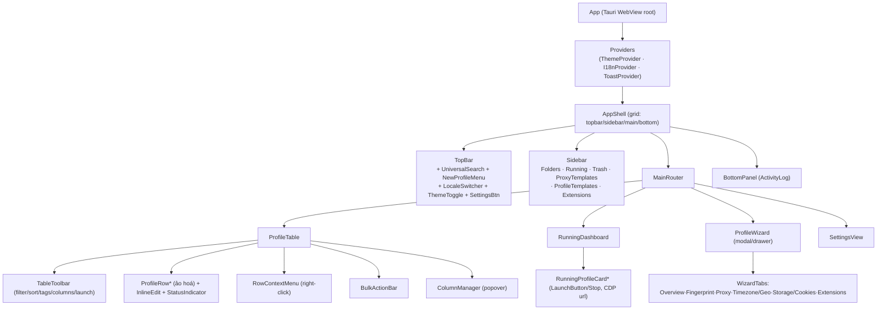

# 08 — Đặc tả UI (clone layout Multilogin X) + Dark mode + i18n

> **Mục đích:** Đặc tả giao diện cho **BrowserX** — app desktop LOCAL (Tauri + Rust +
> SQLite, headful không VNC) — **bám sát layout & luồng UX của Multilogin X**, tái dùng
> React frontend của `refs/CloakBrowser-Manager/frontend`. Tài liệu này **chỉ là spec +
> wireframe + component tree**, KHÔNG phải code React thật.
>
> **Nhất quán với:** [`docs/03-target-architecture.md`](03-target-architecture.md)
> (Tauri commands / SQLite schema / launcher) và
> [`docs/07-features-spec.md`](07-features-spec.md) (parity 24 tính năng Multilogin).
> Mọi tham chiếu code cũ dùng `refs/…#Lx-Ly`. Phần "mục tiêu" là **thiết kế đề xuất**,
> chưa tồn tại trong `refs/`.

> ⚖️ **Ghi chú nhãn hiệu (đọc trước):** BrowserX **clone LAYOUT và LUỒNG UX** kiểu
> Multilogin X (bố cục, thao tác, tên khu vực chức năng), **KHÔNG** sao chép **logo,
> tên thương hiệu, icon bộ nhận diện, illustration, hay bất kỳ brand asset** nào của
> Multilogin. Dùng tên riêng **"BrowserX"**, bộ icon mã nguồn mở (`lucide-react` — đã có
> trong frontend gốc), bảng màu riêng. Layout/ý tưởng UX không được bảo hộ nhãn hiệu;
> logo/brand thì có → tránh vi phạm. Xem thêm [`docs/04`](04-licensing-legal-decision.md).

---

## Mục lục

1. [Nguyên tắc thiết kế UI](#1-nguyên-tắc-thiết-kế-ui)
2. [Wireframe layout tổng (ASCII)](#2-wireframe-layout-tổng-ascii)
3. [Sơ đồ vùng & component tree (mermaid)](#3-sơ-đồ-vùng--component-tree-mermaid)
4. [Top bar + Universal search](#4-top-bar--universal-search)
5. [Left sidebar](#5-left-sidebar)
6. [Profile table (khu vực chính)](#6-profile-table-khu-vực-chính)
7. [Create/Edit Profile wizard](#7-createedit-profile-wizard)
8. [Running Profiles dashboard](#8-running-profiles-dashboard)
9. [Bottom panel](#9-bottom-panel)
10. [Settings](#10-settings)
11. [Dark mode: token màu + theme toggle + lưu preference](#11-dark-mode-token-màu--theme-toggle--lưu-preference)
12. [i18n: kiến trúc đa ngôn ngữ](#12-i18n-kiến-trúc-đa-ngôn-ngữ)
13. [Bảng: component Manager cũ → BrowserX](#13-bảng-component-manager-cũ--browserx)
14. [Map hành động UI → Tauri command / Rust core](#14-map-hành-động-ui--tauri-command--rust-core)
15. [Accessibility (a11y) & trạng thái tương tác](#15-accessibility-a11y--trạng-thái-tương-tác)

---

## 1. Nguyên tắc thiết kế UI

1. **Local-first, một cửa sổ Tauri.** UI chạy trong WebView; mọi thao tác gọi **Tauri
   command** qua `invoke()` thay `fetch("/api/...")` (`refs/CloakBrowser-Manager/frontend/src/lib/api.ts#L91-L96`).
2. **Kế thừa design system sẵn có.** Frontend gốc đã dùng **Tailwind** + token
   `surface-0..4`, `accent`/`accent-hover`, `border`/`border-hover`, gray-scale, cùng
   các class tiện ích `.btn / .btn-primary / .btn-secondary / .btn-danger / .input /
   .label` (`refs/CloakBrowser-Manager/frontend/src/styles/globals.css#L44-L66`). BrowserX
   **giữ nguyên hệ token này**, chỉ **mở rộng thành 2 theme** (light/dark) — xem §11.
3. **Icon dùng `lucide-react`** (đã có: `Plus, Search, Monitor, Play, Square, Loader2,
   Lock, PanelLeft…`) — bộ icon MIT mã nguồn mở, **không** dính brand Multilogin.
4. **Lưới 8px.** Spacing theo bội số 4/8px (Tailwind scale) như frontend gốc.
5. **Density cao (kiểu bảng quản trị).** Multilogin X là công cụ vận hành hàng nghìn
   profile → ưu tiên **bảng dày, thao tác nhanh, phím tắt, bulk action**.
6. **A11y không nhân nhượng.** Tương phản WCAG AA (≥4.5:1 text), focus `:focus-visible`
   thấy rõ, HTML ngữ nghĩa (`button`/`table`/`nav`), điều khiển có nhãn — xem §15.

---

## 2. Wireframe layout tổng (ASCII)

Bố cục 3 vùng kiểu Multilogin X: **Top bar** (toàn chiều ngang) · **Left sidebar** ·
**Main content** (Profile table hoặc Running dashboard) · **Bottom panel** (thu gọn được).

```
┌──────────────────────────────────────────────────────────────────────────────────┐
│ TOP BAR                                                                            │
│ [≡] BrowserX   [🔍 Universal search…            ]   [+ New profile ▾] [🌐][☾][⚙]   │
├───────────────┬────────────────────────────────────────────────────────────────────┤
│ SIDEBAR       │ MAIN CONTENT — Profile table                                        │
│               │ ┌────────────────────────────────────────────────────────────────┐ │
│ ▸ All profiles│ │ [☑][filter ▾][sort ▾][tags ▾]        [⋮ columns][⟳][▶ Launch] │ │
│ ▾ Folders     │ ├──┬──────────┬────────┬──────┬────────┬─────────┬──────┬─────────┤ │
│   • Work      │ │☐ │ ● Name   │ Status │ OS   │ Proxy  │ Tags    │ Last │  ⋮      │ │
│   • Ecom      │ ├──┼──────────┼────────┼──────┼────────┼─────────┼──────┼─────────┤ │
│ ● Running (3) │ │☑ │ ● acc-01 │ running│ win  │ US ✔   │ [work]  │ 2m   │  ⋮      │ │
│ 🗑 Trash      │ │☐ │ ○ acc-02 │ stopped│ mac  │ —      │ [ecom]  │ 1d   │  ⋮      │ │
│ ─────────     │ │☐ │ ○ acc-03 │ stopped│ win  │ DE ✔   │ [+2]    │ 3d   │  ⋮      │ │
│ 🌐 Proxy tpl  │ │  … (ảo hoá dòng — hàng nghìn profile)                          │ │
│ 📋 Profile tpl│ └────────────────────────────────────────────────────────────────┘ │
│ 🧩 Extensions │  Bulk bar (khi chọn ≥1):  3 selected  [▶ Launch][■ Stop][🏷][🗑][…] │
├───────────────┴────────────────────────────────────────────────────────────────────┤
│ BOTTOM PANEL  [Activity ▾] running:3 · queued:1 · errors:0        [logs][clear][▴]  │
└──────────────────────────────────────────────────────────────────────────────────┘
```

**Khi bấm New/Edit profile** → mở **Wizard** dạng modal/drawer phủ Main content (§7).
**Khi bấm "Running (N)"** → Main content đổi sang **Running dashboard** (§8).

---

## 3. Sơ đồ vùng & component tree (mermaid)



---

## 4. Top bar + Universal search

Thanh trên cùng toàn chiều ngang (kiểu Multilogin X), luôn hiển thị.

| Phần tử | Mô tả | Hành vi / trạng thái |
|---|---|---|
| **Sidebar toggle** `≡` | Ẩn/hiện sidebar (có sẵn ở App gốc: `PanelLeftClose/PanelLeft`, `App.tsx#L2`) | Lưu trạng thái collapsed vào `settings` |
| **Wordmark "BrowserX"** | Chữ + icon `Monitor` (không dùng logo Multilogin) | Bấm → về "All profiles" |
| **Universal search** | Ô tìm kiếm rộng ở giữa; tìm theo **tên, tag, notes, proxy label, OS** | Debounce ~250ms; server-side (Rust) khi >N profiles — thay client filter gốc `ProfileList.tsx#L14-L17` |
| **New profile ▾** | Nút chính; menu xổ: *Blank* / *From template* / *Bulk create* | Mở Wizard (§7) hoặc dialog bulk |
| **Locale switcher** `🌐` | Đổi ngôn ngữ (§12) | Popover danh sách locale; tick locale hiện tại |
| **Theme toggle** `☾/☀` | Light ⇄ Dark ⇄ System (§11) | Icon phản ánh theme; lưu preference |
| **Settings** `⚙` | Mở SettingsView (§10) | — |

**Universal search — chi tiết:**
- Kết quả gộp nhóm: *Profiles*, *Folders*, *Templates*, *Tags*.
- Phím tắt mở nhanh: `Cmd/Ctrl+K` (command palette nhẹ), `Esc` để xoá/đóng.
- Empty state: "Không có kết quả cho «…»" + gợi ý xoá filter.
- A11y: `role="searchbox"`, `aria-label`, kết quả trong `role="listbox"`, điều hướng ↑/↓/Enter.

---

## 5. Left sidebar

Điều hướng dọc kiểu Multilogin X. Mỗi mục là `nav > button`/`a` ngữ nghĩa, có trạng thái
active (`aria-current="page"`), badge số đếm.

| Mục | Nội dung | Nguồn dữ liệu / ghi chú |
|---|---|---|
| **All profiles** | Toàn bộ profile chưa xoá | `list_profiles` (§14) |
| **Folders** (cây) | Nhóm profile theo thư mục do user tạo; kéo-thả profile vào folder | **Mới** — bảng `folders` + `profile_folder` (mở rộng schema docs/03 §2); gốc chưa có |
| **Running Profiles (N)** | Lọc nhanh các phiên đang chạy → mở Running dashboard (§8) | đếm `status="running"` (như `ProfileList.tsx#L20`) |
| **Trash** 🗑 | Profile đã xoá mềm; restore / xoá vĩnh viễn | **Mới** — cột `deleted_at` (soft-delete); gốc xoá cứng |
| **Proxy templates** 🌐 | Cấu hình proxy tái dùng (scheme/host/port/cred mã hoá) | bảng `proxies` (docs/03 §2, cred **mã hoá**) |
| **Profile templates** 📋 | Mẫu tạo profile hàng loạt (fingerprint/OS/screen mặc định) | **Mới** — docs/07 §7 ghi "template: không có" → BrowserX xây |
| **Extensions** 🧩 | Kho extension (.crx/thư mục) gán vào profile | **Mới** — map sang flag `--load-extension`/`--disable-extensions-except` khi spawn |

- Sidebar **collapsible**: thu về icon-only (tooltip tên khi hover/focus).
- Divider (`─────`) tách nhóm "điều hướng profile" và "tài nguyên tái dùng".
- Kéo-thả (drag-drop) profile từ table vào Folder → gọi `move_profile_to_folder` (§14).

---

## 6. Profile table (khu vực chính)

Thay panel list hẹp gốc (`ProfileList.tsx`) bằng **bảng dày** kiểu Multilogin X, hỗ trợ
hàng nghìn dòng.

### 6.1 Cột mặc định

| Cột | Nội dung | Ghi chú |
|---|---|---|
| ☑ (checkbox) | Chọn dòng / chọn tất cả (header) | Nền tảng cho **bulk actions** |
| **Status** | `StatusIndicator` (chấm + ping khi running) — **tái dùng** `StatusIndicator.tsx` | running=emerald, stopped=gray |
| **Name** | Tên profile (inline-editable) | click đúp → inline edit |
| **OS / Fingerprint** | `platform` (win/mac/linux) + cảnh báo mismatch nếu ≠ host (docs/03 §6) | badge `⚠` khi mismatch |
| **Proxy** | Nhãn proxy + cờ quốc gia + health `✔/✖/…` | health-check là mục 🔴 docs/07 §4 |
| **Tags** | Chip tag màu (tái dùng cách render tag `ProfileList.tsx#L78-L90`) | overflow → `[+N]` |
| **Last used** | thời điểm chạy gần nhất | từ bảng `audit` (docs/03 §2) |
| **⋮ (actions)** | Menu hành động nhanh trên dòng | mở `RowContextMenu` |

### 6.2 Column manager
- Popover từ nút `⋮ columns`: bật/tắt cột, kéo đổi thứ tự, ghim cột (Name/Status).
- Cột tuỳ chọn thêm: `fingerprint_seed`, `timezone`, `locale`, `screen`, `created_at`, `notes`.
- Lưu cấu hình cột vào `settings` (key `table.columns`) → gọi `set_setting` (§14).

### 6.3 Right-click context menu (mỗi dòng)
`Launch / Stop` · `Edit` · `Duplicate` · `Save as template` · `Move to folder ▸` ·
`Add tag ▸` · `Export cookies` · `Open user-data-dir` · `Delete`. Mỗi mục map 1 command (§14).

### 6.4 Bulk actions (khi chọn ≥1 dòng)
Thanh **BulkActionBar** nổi lên: `N selected` + `▶ Launch all` · `■ Stop all` ·
`🏷 Tag` · `📁 Move` · `⧉ Duplicate` · `⇩ Export` · `🗑 Delete`. Launch hàng loạt đi qua
**hàng đợi + Semaphore** trong Rust (docs/03 §5) — không spawn ồ ạt.

### 6.5 Inline edit
- Sửa nhanh `Name`, `Tags`, `Proxy` ngay trong ô (Enter lưu, Esc huỷ).
- Gọi `update_profile` với chỉ field đổi; hiển thị spinner nhỏ + toast lỗi actionable.

### 6.6 Filter / Sort
- **Filter** (`filter ▾`): theo OS, status, folder, tag, proxy country, có/không proxy.
- **Sort** (`sort ▾`): theo Name, Status, Last used, Created; asc/desc; sort **phía server**
  (thay `GET /api/profiles` trả toàn bộ + client filter, docs/07 §7 "không scale").
- Filter/sort hiện trạng lưu vào `settings` để giữ giữa các phiên.

### 6.7 Drag-drop
- Kéo **dòng → Folder** ở sidebar (gán folder).
- Kéo **đổi thứ tự cột** trong Column manager.
- Kéo **tag preset** thả vào dòng để gán nhanh.
- Tôn trọng `prefers-reduced-motion`: tắt animation kéo mượt khi user tắt motion.
- A11y: cung cấp **fallback bàn phím** cho mọi drag-drop (menu "Move to folder", "Reorder").

### 6.8 Trạng thái bảng
- **Loading:** skeleton rows. **Empty (0 profile):** CTA "Tạo profile đầu tiên".
- **Sparse (ít):** vẫn hiện header + hint. **Dense (nghìn):** **ảo hoá dòng** (virtualized)
  để giữ hiệu năng. **Error:** banner + nút "Thử lại".

---

## 7. Create/Edit Profile wizard

Mở dạng **drawer phải** hoặc **modal** (kiểu Multilogin X), **6 tab**. **Tái dùng &
mở rộng** `ProfileForm.tsx` (đã có form 1-cột dài) — tách nội dung thành tab, giữ nguyên
các preset sẵn có: `RESOLUTION_PRESETS`, `GPU_PRESETS`, `TAG_COLORS`
(`refs/CloakBrowser-Manager/frontend/src/components/ProfileForm.tsx#L12-L54`).

| Tab | Trường chính | Map field / flag (docs/07 §2) |
|---|---|---|
| **1. Overview** | `name`, `tags`, folder, `notes`, chọn từ template | `profiles.name/notes` + tags (`database.py#L61-L66`) |
| **2. Fingerprint** | `fingerprint_seed` (int/chuỗi mở rộng), **OS/platform** (kèm cảnh báo mismatch docs/03 §6), `gpu_vendor/renderer` (GPU_PRESETS), `hardware_concurrency`, `device_memory`, `screen_width/height` (RESOLUTION_PRESETS), `brand*`, `platform_version`, `noise on/off`, `fonts-dir`, `windows-font-metrics` | các flag `--fingerprint*` bảng docs/07 §2; các flag còn thiếu là 🔴 BrowserX bổ sung |
| **3. Proxy** | chọn từ **Proxy template** hoặc nhập scheme/host/port/user/pass; nút **Test proxy** (health-check) | `proxies` cred **mã hoá** (docs/03 §2); `_resolve_proxy_config` `browser.py#L1305-L1352` |
| **4. Timezone / Geo** | `geoip` auto-khớp proxy (toggle), `timezone`, `locale`, toạ độ `--fingerprint-location` | GeoIP `geoip.py#L54-L106`; location là 🔴 docs/07 §5 |
| **5. Storage / Cookies** | `user_data_dir` (đường dẫn), import/export cookie (JSON/`storage_state`), xoá storage | persistence `browser.py#L347-L471`; import/export là 🔴 docs/07 §6 |
| **6. Extensions** | chọn extension từ kho gán vào profile | **mới**, map `--load-extension` khi spawn (docs/03 §3.2) |

**Hành vi wizard:**
- **Create vs Edit:** `profile===null` = create (như `ProfileForm.tsx#L56` `isEdit`).
- Nút footer: `Cancel` · `Save` (tái dùng icon `Save/Trash2/X` `ProfileForm.tsx#L1`);
  Edit có thêm `Delete` (đỏ, xác nhận 2 bước).
- **Validation** theo tab, hiện lỗi inline actionable ("Port phải 1–65535", không chỉ "Invalid").
- **Loading khi lưu:** nút Save → spinner (`Loader2`) + disable; lỗi → toast + giữ dữ liệu.
- **Cảnh báo mismatch OS:** khi `platform` (tab 2) ≠ host OS → banner ⚠ vàng, không chặn (docs/03 §6).
- Tab có lỗi hiển thị chấm đỏ trên nhãn tab; a11y `role="tablist"`/`role="tab"`/`aria-selected`.

---

## 8. Running Profiles dashboard

Kích hoạt khi bấm **"Running (N)"** ở sidebar. Dạng **lưới thẻ** (card grid) mỗi phiên
đang chạy — thay `ProfileViewer` noVNC gốc (đã **BỎ**, docs/03 §7).

**RunningProfileCard:** tên + `StatusIndicator` (ping) · OS/proxy · **uptime** · **PID** ·
**CDP url** (copy) · **RAM** (nếu đo được) · nút **Stop** (`LaunchButton` status="running",
**tái dùng** `LaunchButton.tsx`) · `Bring to front` (focus cửa sổ headful) · `Open DevTools`.

- **Header dashboard:** tổng `running / queued / max_concurrent` (docs/03 §5 Semaphore) +
  nút `Stop all`.
- **Queued view:** hàng chờ launch (vượt `max_concurrent`) hiển thị "đang chờ khe RAM".
- **Empty state:** "Chưa có profile nào đang chạy" + CTA về table.
- Vì **headful thật** (không VNC), card **không nhúng màn hình**; thao tác trực tiếp trên
  cửa sổ Chromium bằng chuột/bàn phím, hoặc automation qua CDP (docs/03 §4).

---

## 9. Bottom panel

Thanh **Activity / Log** thu gọn được ở đáy (kiểu status bar Multilogin X).

- **Thu gọn (mặc định):** 1 dòng — `running:N · queued:M · errors:K` + đồng hồ + nút `▴` mở rộng.
- **Mở rộng:** khung log cuộn (tail) các sự kiện từ bảng `audit` (docs/03 §2): create/edit/
  launch/stop/error, kèm timestamp + profile. Nút `logs` (mở file log), `clear` (xoá view).
- Nhận **Tauri events** realtime (`emit`/`listen`) khi trạng thái phiên đổi (docs/03 §1
  "invoke() / events"). Lỗi launch hiện badge đỏ + link tới chi tiết.
- A11y: vùng log `role="log"` `aria-live="polite"`; không tự cuộn giật khi user đang đọc.

---

## 10. Settings

Trang/drawer cấu hình app (bảng `settings` docs/03 §2). Nhóm mục:

| Nhóm | Mục | Lưu ở |
|---|---|---|
| **Appearance** | Theme (Light/Dark/System) · ngôn ngữ (locale) · density bảng | `settings`: `theme`, `locale`, `table.density` |
| **Performance** | `max_concurrent` (khe RAM, docs/03 §5) · `idle_timeout` reclaim | `settings` |
| **Storage & paths** | thư mục `user_data_dir` gốc · binary cache dir (`CLOAKBROWSER_CACHE_DIR`, docs/03 §3.1) | `settings` |
| **Binary** | phiên bản Chromium · nút "Kiểm tra/tải lại" (verify Ed25519, docs/03 §3.4) · mirror nội bộ | `settings` + binary manager |
| **Security** | trạng thái khoá keychain (mã hoá proxy/cookie, docs/03 §2) · xoá secret | OS keychain |
| **Về BrowserX** | version · giấy phép (MIT code, binary proprietary — docs/04) · disclaimer nhãn hiệu | tĩnh |

- Mỗi thay đổi gọi `set_setting(key, value)` (§14); áp dụng tức thì khi có thể (theme/locale).
- A11y: form dùng `<label for>` gắn control (tái dùng class `.label` `globals.css#L63-L65`).

---

## 11. Dark mode: token màu + theme toggle + lưu preference

Frontend gốc **chỉ có dark** (màu hardcode qua `surface-0..4`, `accent`, `border` trong
Tailwind config; các class ở `globals.css#L44-L66`). BrowserX **nâng thành hệ 2 theme** bằng
**CSS variables** — ánh xạ token Tailwind (`bg-surface-2`, `text-accent`…) sang biến
`--color-*`, rồi đổi giá trị biến theo `:root` (light) và `.dark` (dark). Không cần đổi
markup các component đã có.

### 11.1 Semantic tokens (dùng chung cả 2 theme)

| Token (biến CSS) | Vai trò | Áp cho class Tailwind hiện có |
|---|---|---|
| `--color-surface-0` | nền app ngoài cùng | `bg-surface-0` (`LoginPage.tsx#L29`) |
| `--color-surface-1..4` | nền tầng: panel / hàng / hover / chip | `bg-surface-1..4`, `hover:bg-surface-2/4` |
| `--color-border` / `--color-border-hover` | viền / viền hover | `border-border`, `border-border-hover` |
| `--color-accent` / `--color-accent-hover` | màu nhấn (nút chính, focus ring) | `.btn-primary`, `focus:ring-accent` |
| `--color-text` / `--color-text-muted` | chữ chính / phụ | `text-gray-100`, `text-gray-400/500` |
| `--color-danger` / `--color-success` / `--color-warning` | trạng thái | `.btn-danger`, `emerald-400`, badge ⚠ |

### 11.2 Bảng giá trị token (light / dark)

> Đề xuất — mọi cặp text/nền đạt **WCAG AA ≥ 4.5:1** (kiểm bằng contrast checker khi triển khai).

| Token | Light | Dark (đề xuất — tinh chỉnh từ gốc) |
|---|---|---|
| `surface-0` | `#ffffff` | `#0b0d10` |
| `surface-1` | `#f7f8fa` | `#14171c` |
| `surface-2` | `#eef0f3` | `#1b1f26` |
| `surface-3` | `#e4e7eb` | `#232830` |
| `surface-4` | `#d6dae0` | `#2c323b` |
| `border` | `#d9dde3` | `#2a2f37` |
| `border-hover` | `#c2c8d0` | `#3a414b` |
| `accent` | `#4f46e5` | `#6366f1` |
| `accent-hover` | `#4338ca` | `#818cf8` |
| `text` | `#1a1d21` | `#e6e8eb` |
| `text-muted` | `#5b6470` | `#9aa3ad` |
| `danger` | `#dc2626` | `#f87171` |
| `success` | `#059669` | `#34d399` |
| `warning` | `#b45309` | `#fbbf24` |

### 11.3 Cơ chế theme (đề xuất)

1. **Ba lựa chọn:** `light` · `dark` · `system` (theo `prefers-color-scheme`).
2. **Áp theme:** `ThemeProvider` set thuộc tính trên `<html>`: `class="dark"` hoặc
   `data-theme`. CSS: `:root { --color-*: <light> }` và `.dark { --color-*: <dark> }`.
   Tailwind bật `darkMode: "class"` (hoặc dùng biến trong `theme.extend.colors`).
3. **Chống nháy (FOUC):** script nhỏ đọc theme đã lưu **trước** khi React mount → set class
   ngay. Với `system`, lắng nghe `matchMedia("(prefers-color-scheme: dark)")`.
4. **Lưu preference (bền):** ghi vào **bảng `settings`** (`key="theme"`, docs/03 §2) qua
   `set_setting` (§14) — nguồn sự thật cross-device-độc-lập; **không** chỉ dựa `localStorage`.
   Khi khởi động, Rust trả `theme` trong `get_settings` để áp sớm.
5. **Toggle ở Top bar** (`☾/☀`, §4) và ở Settings → Appearance (§10) — hai nơi cùng đồng bộ.
6. **Reduced motion:** transition đổi theme tôn trọng `prefers-reduced-motion` (không animate
   khi user tắt). Không dùng `transition: all` — liệt kê rõ `background-color, color, border-color`.

---

## 12. i18n: kiến trúc đa ngôn ngữ

Frontend gốc **hardcode chuỗi tiếng Anh** trong JSX (vd "Search profiles…", "New Profile",
"Launching…"). BrowserX **rút toàn bộ chuỗi ra file locale** dùng **i18next + react-i18next**.

### 12.1 Stack & cấu trúc

- **Thư viện:** `i18next` + `react-i18next` + `i18next-browser-languagedetector`.
- **Ngôn ngữ mặc định:** **Tiếng Việt (`vi`)** — nhất quán bộ docs; **fallback `en`**.
- **Namespaces:** tách theo vùng UI để lazy-load: `common`, `sidebar`, `table`, `wizard`,
  `settings`, `running`, `errors`.
- **Cấu trúc file locale** (đề xuất, trong `frontend/src/locales/`):

```
locales/
  vi/  common.json  sidebar.json  table.json  wizard.json  settings.json  running.json  errors.json
  en/  common.json  sidebar.json  table.json  wizard.json  settings.json  running.json  errors.json
```

Ví dụ `locales/vi/table.json`:
```json
{
  "columns": { "name": "Tên", "status": "Trạng thái", "os": "Hệ điều hành", "proxy": "Proxy", "tags": "Thẻ", "lastUsed": "Dùng gần đây" },
  "toolbar": { "filter": "Lọc", "sort": "Sắp xếp", "columns": "Cột", "launch": "Khởi chạy" },
  "bulk": { "selected_one": "{{count}} đã chọn", "selected_other": "{{count}} đã chọn", "launchAll": "Chạy tất cả", "stopAll": "Dừng tất cả" },
  "empty": "Chưa có profile nào", "noMatch": "Không có kết quả cho «{{query}}»"
}
```

### 12.2 Cách dùng trong component
- Thay chuỗi cứng bằng hook `useTranslation("table")` → `t("toolbar.launch")`.
- Số nhiều dùng khoá `_one/_other` (`{{count}}`); nội suy biến `{{query}}`, `{{name}}`.
- Ngày/giờ, số: format qua `Intl.DateTimeFormat`/`Intl.NumberFormat` theo locale hiện tại.

### 12.3 Chọn & lưu ngôn ngữ
- **LocaleSwitcher** ở Top bar (§4) + Settings → Appearance (§10).
- **Lưu preference:** ghi `settings.locale` (docs/03 §2) qua `set_setting`; khởi động đọc từ
  `get_settings`. LanguageDetector chỉ là fallback khi chưa có giá trị.

### 12.4 Cách thêm ngôn ngữ mới (quy trình)
1. Tạo thư mục `locales/<lang>/` và **copy toàn bộ file `.json`** từ `en/` làm khung.
2. Dịch từng giá trị (giữ nguyên key và placeholder `{{…}}`).
3. Đăng ký `<lang>` vào danh sách `supportedLngs` của cấu hình i18next.
4. Thêm nhãn hiển thị vào LocaleSwitcher (tên bản ngữ, vd "Tiếng Việt", "English", "中文").
5. (Tuỳ chọn) kiểm khoá thiếu bằng công cụ (vd `i18next-parser`) trước khi ship.
- **RTL:** khi thêm ngôn ngữ RTL (Ả Rập/Do Thái), đặt `dir="rtl"` trên `<html>` theo locale;
  layout dùng logical properties để đảo chiều.
- A11y: cập nhật `<html lang="…">` theo locale để screen reader phát âm đúng.

---

## 13. Bảng: component Manager cũ → BrowserX

Các component hiện có tại `refs/CloakBrowser-Manager/frontend/src/components/`:

| Component gốc | Vai trò gốc | BrowserX | Cách xử lý |
|---|---|---|---|
| `ProfileList.tsx` | Panel danh sách hẹp + search client-side (`#L14-L17`) | → **ProfileTable** (§6) | **Tái dùng ý tưởng, viết lại** thành bảng dày: giữ render tag (`#L78-L90`) + đếm running (`#L20`); search chuyển **server-side** |
| `ProfileForm.tsx` | Form tạo/sửa 1 cột dài | → **ProfileWizard** 6 tab (§7) | **Tái dùng & tách tab**: giữ nguyên `RESOLUTION_PRESETS`/`GPU_PRESETS`/`TAG_COLORS` (`#L12-L54`), cờ `isEdit` (`#L56`) |
| `LaunchButton.tsx` | Nút Launch/Stop + loading/error | dùng ở **table, wizard, Running dashboard** | **Tái dùng gần như nguyên trạng**; đổi `onLaunch/onStop` gọi `invoke()` thay `fetch` |
| `StatusIndicator.tsx` | Chấm running/stopped + ping | dùng ở **table & Running card** | **Tái dùng nguyên trạng** |
| `ProfileViewer.tsx` (noVNC) | Nhúng màn hình qua noVNC/WebSocket | **BỎ** | Headful thật, không VNC (docs/03 §0 principle, §7 bảng "Bỏ"); xoá luôn `novnc.d.ts` |
| `LoginPage.tsx` | Nhập AUTH_TOKEN chung | **BỎ** | App local, bỏ token; bảo vệ bằng OS user (docs/03 §7 "Auth: Bỏ") |
| `lib/api.ts` | `fetch("/api/...")` (`#L91-L157`) | → **`invoke()` wrapper** | **Viết lại lớp API**: giữ interface `Profile` (`#L4-L35`), thay transport HTTP→Tauri |

**Component mới cần xây (không có ở gốc):** `AppShell`, `TopBar`, `UniversalSearch`,
`Sidebar` (Folders/Trash/ProxyTemplates/ProfileTemplates/Extensions), `TableToolbar`,
`ColumnManager`, `RowContextMenu`, `BulkActionBar`, `RunningDashboard`, `BottomPanel`,
`SettingsView`, `ThemeProvider`/`ThemeToggle`, `I18nProvider`/`LocaleSwitcher`.

---

## 14. Map hành động UI → Tauri command / Rust core

Mỗi thao tác UI gọi **một Tauri command** (`#[tauri::command]`, docs/03 §1) qua `invoke()`
— thay các route FastAPI gốc (`main.py`). Bảng đề xuất (tên command là **thiết kế**):

| Hành động UI | Command (`invoke`) | Rust core / DB (docs/03) | Route gốc thay thế |
|---|---|---|---|
| Nạp danh sách (filter/sort/trang) | `list_profiles(query)` | Profile store SQLite + filter/sort **server** (§5, §2) | `GET /api/profiles` (`main.py#L438-L439`) |
| Universal search | `search(query)` | truy vấn SQLite (name/tag/notes/proxy) | (client filter cũ) |
| Tạo profile | `create_profile(data)` | insert `profiles` (+seed) | `POST /api/profiles` |
| Sửa / inline edit | `update_profile(id, patch)` | update `profiles` | `PUT /api/profiles/{id}` |
| Nhân bản | `duplicate_profile(id)` | copy row + user_data_dir mới | (không có) |
| Xoá (soft) / Trash | `delete_profile(id)` / `restore_profile(id)` | set/clear `deleted_at` | `DELETE /api/profiles/{id}` |
| **Launch** | `launch_profile(id)` | Launcher: build_args + spawn headful + CDP (§3, §4) qua Semaphore (§5) | `POST /api/profiles/{id}/launch` |
| **Stop** | `stop_profile(id)` | `kill(pid)` theo PID Rust nắm (§4) | `POST /.../stop` |
| Bulk launch/stop | `launch_many(ids)` / `stop_many(ids)` | hàng đợi + Semaphore (§5) | (không có) |
| Test proxy | `test_proxy(proxy)` | health-check (🔴 docs/07 §4) | (không có) |
| Import/Export cookie | `import_cookies(id,data)` / `export_cookies(id)` | đọc/ghi `user_data_dir`/`storage_state` (docs/07 §6) | (không có) |
| Tag / Folder | `set_tags(id,tags)` / `move_profile_to_folder(id,folder)` | `profile_tags` / `folders` | (một phần) |
| Template | `save_as_template(id)` / `create_from_template(tid)` | bảng templates (mới) | (không có) |
| Extensions | `set_profile_extensions(id,exts)` | map `--load-extension` (§3.2) | (không có) |
| Cột / filter/sort state | `set_setting(key,value)` / `get_settings()` | bảng `settings` (§2) | (không có) |
| **Theme** | `set_setting("theme",v)` / đọc trong `get_settings` | `settings` (§11.3) | (không có) |
| **Locale** | `set_setting("locale",v)` | `settings` (§12.3) | (không có) |
| Binary check/tải | `ensure_binary()` | Binary manager + verify Ed25519 (§3.4) | (không có) |
| Sự kiện realtime | *(Tauri `emit`/`listen`)* | trạng thái phiên → BottomPanel/RunningDashboard | (WebSocket VNC cũ — bỏ) |

> Toàn bộ command bám sát luồng vòng đời phiên ở **docs/03 §4** (sequence diagram) và
> mô hình dữ liệu **docs/03 §2**.

---

## 15. Accessibility (a11y) & trạng thái tương tác

**Bắt buộc (WCAG AA):**
- Tương phản text ≥ **4.5:1**, UI element ≥ **3:1** — kiểm mọi cặp token light/dark ở §11.2.
- **Focus thấy rõ** trên mọi phần tử tương tác qua `:focus-visible` (frontend gốc đã có
  `focus:ring-2 focus:ring-accent/50` ở `.btn`, `globals.css#L45`) — giữ và mở rộng cho row/tab/menu.
- **HTML ngữ nghĩa:** `nav` (sidebar), `table/thead/tbody/th/td` (profile table), `button`
  (không `div` giả nút), `dialog` (wizard), `role="tablist/tab/tabpanel"` (wizard tabs).
- **Nhãn cho mọi control:** `<label for>` (tái dùng `.label`), hoặc `aria-label` cho icon-button
  (toggle theme, locale, actions `⋮`).
- **Bàn phím vận hành hết:** điều hướng table (↑/↓, Space chọn dòng, Enter mở), đóng
  modal bằng `Esc`, `Cmd/Ctrl+K` mở search; **mọi drag-drop có fallback menu** (§6.7).
- **Không dùng màu đơn lẻ để truyền nghĩa:** status có chấm **+ chữ**; proxy health có
  icon **+ text**; mismatch OS có badge ⚠ **+ tooltip**.

**Trạng thái tương tác (mọi phần tử):** default · hover · active · focus · disabled ·
loading · error — đã có tiền lệ ở `LaunchButton.tsx` (loading spinner, error text). Áp
đồng bộ cho nút bulk, inline edit, wizard save.

**Motion:** tôn trọng `prefers-reduced-motion`; ưu tiên animate `transform`/`opacity`;
**không** dùng `transition: all` (liệt kê thuộc tính cụ thể) — kể cả animation `ping` của
`StatusIndicator` nên tắt khi user tắt motion.

**Empty / error / loading** đã đặc tả ở từng khu vực (§6.8, §7, §8, §9) — thông điệp lỗi
**actionable** (nêu cách sửa), không chỉ "Invalid".

